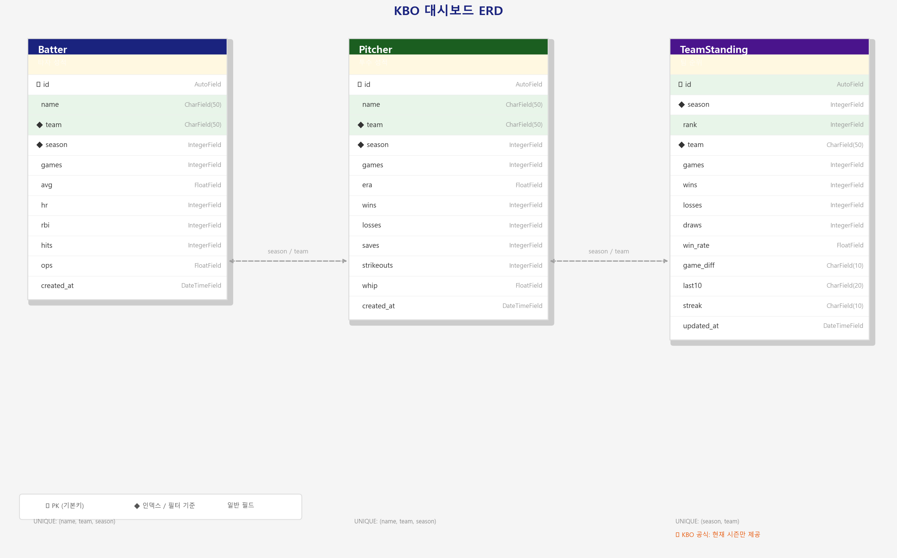
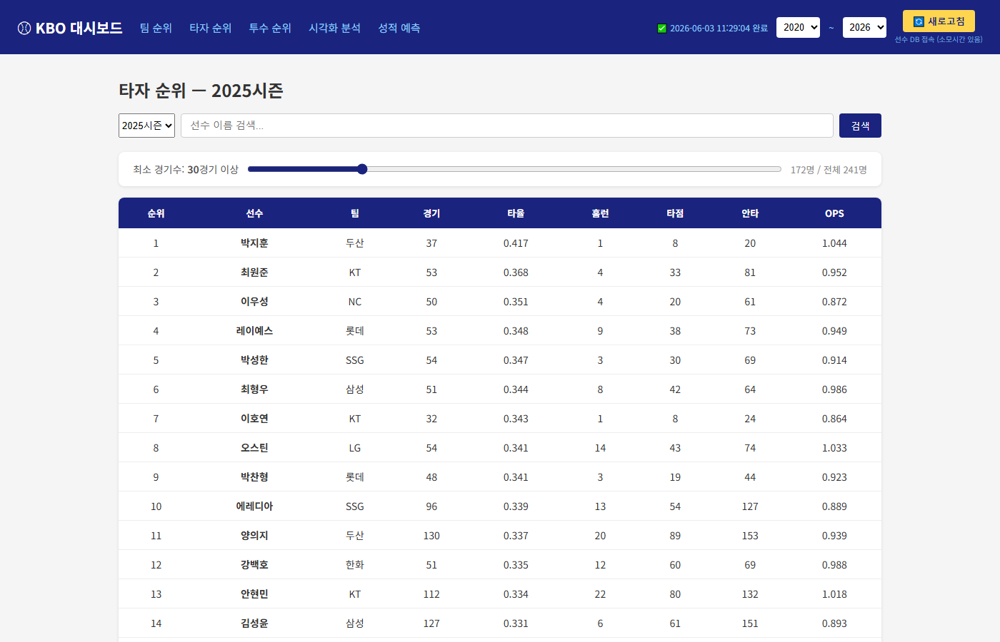

# kbo 크롤링 프로그램

----------------------------------------
1. 정적 페이지에는 request+ Beautifulsoup,  js렌더링 페이지에는 playwright과 Selenium 활용
2. Django 템플릿과 chart.js로 제작
3. 선수 시즌 성적 db 저장한 이후 팀별 선수별 차트 비교 및 시각화 분석과 성적 예측 기능 추가
4. 스크롤바로 특정 경기 미만의 선수 수는 제거하여 향상성 유지

## ERD

## 인터페이스

