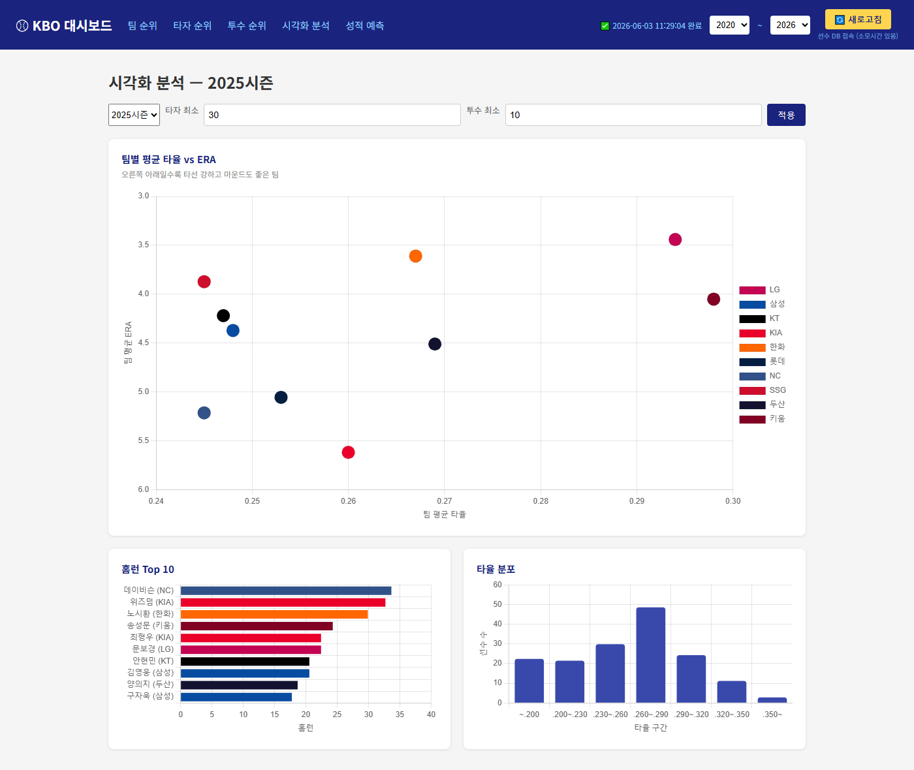

# kbo 크롤링 프로그램

----------------------------------------
1. 정적 페이지에는 request+ Beautifulsoup,  js렌더링 페이지에는 playwright과 Selenium 활용
2. Django 템플릿과 chart.js로 제작
3. 선수 시즌 성적 db 저장한 이후 팀별 선수별 차트 비교 및 시각화 분석과 성적 예측 기능 추가
4. 스크롤바로 특정 경기 미만의 선수 수는 제거하여 향상성 유지

### 업데이트
새로고침 버튼 누르면 24시간 이내 크롤링한 시즌은 자동 스킵
드롭다운에 2025 ✅06-03 11:29 형태로 마지막 크롤링 시간 표시
스킵된 시즌은 콘솔에 [SKIP] 2025시즌 — 마지막 크롤링: ... 출력
새로운 시즌만 실제 크롤링 → 범위 선택해도 이미 한 건 건너뜀

## ERD

## 인터페이스
1. 기본 화면
     

2. 시각화 분석 화면

